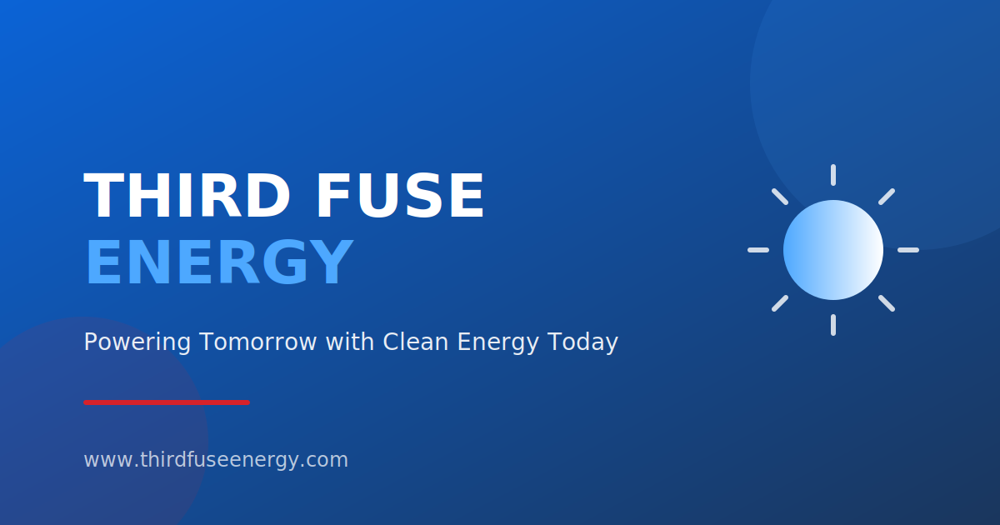

# Third Fuse Energy Corp

A modern, high-performance corporate website for Third Fuse Energy Corp, a leading solar energy solutions provider. Built with Next.js, TypeScript, Tailwind CSS, and Framer Motion.



## 🌟 Features

- **Static Site Generation (SSG)** - Lightning-fast page loads with pre-rendered pages
- **Responsive Design** - Mobile-first approach, optimized for all devices
- **Smooth Animations** - Framer Motion powered transitions and interactions
- **SEO Optimized** - Meta tags, Open Graph, JSON-LD structured data, sitemap
- **Accessible** - WCAG 2.1 AA compliant components
- **Contact Form** - Server-side email handling with validation and spam protection
- **Type Safe** - Full TypeScript coverage with strict mode
- **Modern Tooling** - ESLint, Prettier, Jest for code quality

## 🚀 Quick Start

### Prerequisites

- Node.js 18+ (LTS recommended)
- npm 9+ or yarn

### Installation

1. Clone the repository:
```bash
git clone https://github.com/your-org/third-fuse-energy.git
cd third-fuse-energy
```

2. Install dependencies:
```bash
npm install
```

3. Set up environment variables:
```bash
cp .env.example .env.local
```

4. Configure your environment variables in `.env.local`:
```env
# Required for contact form
EMAIL_SMTP_HOST=smtp.your-email-provider.com
EMAIL_SMTP_PORT=587
EMAIL_SMTP_USER=your-email@example.com
EMAIL_SMTP_PASS=your-email-password

# Where contact form submissions should be delivered (owner/admin inbox)
FORM_RECIPIENT_EMAIL=deepak5122d@gmail.com

# Site URL (for sitemap generation)
NEXT_PUBLIC_SITE_URL=https://thirdfuseenergy.com
```

5. Start the development server:
```bash
npm run dev
```

6. Open [http://localhost:3000](http://localhost:3000) in your browser.

## 📁 Project Structure

```
third-fuse-energy/
├── .github/
│   └── workflows/
│       └── ci.yml              # GitHub Actions CI pipeline
├── public/
│   ├── images/                 # Static images and logos
│   │   ├── projects/           # Project showcase images
│   │   ├── logo.svg            # Main logo
│   │   ├── logo-white.svg      # White version for dark backgrounds
│   │   └── og-default.svg      # Default Open Graph image
│   ├── favicon.svg             # Site favicon
│   └── manifest.json           # PWA manifest
├── src/
│   ├── components/             # Reusable React components
│   │   ├── ContactForm.tsx     # Contact form with validation
│   │   ├── Footer.tsx          # Site footer
│   │   ├── Header.tsx          # Navigation header
│   │   ├── Hero.tsx            # Hero section component
│   │   ├── Layout.tsx          # Page layout wrapper
│   │   ├── Modal.tsx           # Accessible modal component
│   │   ├── ProjectCard.tsx     # Project showcase card
│   │   ├── SEO.tsx             # Meta tags and structured data
│   │   └── ServiceCard.tsx     # Service feature card
│   ├── content/                # JSON content files (CMS-ready)
│   │   ├── about.json          # About page content
│   │   ├── home.json           # Homepage content
│   │   ├── services.json       # Services content
│   │   ├── site.json           # Global site config
│   │   └── projects/           # Individual project files
│   ├── lib/                    # Utility functions
│   │   ├── email.ts            # Email sending utilities
│   │   ├── motion.ts           # Framer Motion variants
│   │   └── utils.ts            # Helper functions
│   ├── pages/                  # Next.js pages
│   │   ├── api/
│   │   │   └── contact.ts      # Contact form API endpoint
│   │   ├── _app.tsx            # App wrapper with providers
│   │   ├── _document.tsx       # Custom document head
│   │   ├── index.tsx           # Homepage
│   │   ├── about.tsx           # About page
│   │   ├── services.tsx        # Services page
│   │   ├── projects.tsx        # Projects showcase
│   │   ├── contact.tsx         # Contact page
│   │   ├── privacy.tsx         # Privacy policy
│   │   └── terms.tsx           # Terms of service
│   ├── styles/
│   │   └── globals.css         # Global styles and Tailwind
│   └── __tests__/              # Test files
├── .env.example                # Environment template
├── .eslintrc.json              # ESLint configuration
├── .prettierrc                 # Prettier configuration
├── jest.config.js              # Jest configuration
├── next.config.js              # Next.js configuration
├── next-sitemap.config.js      # Sitemap generation config
├── package.json                # Dependencies and scripts
├── tailwind.config.js          # Tailwind CSS configuration
└── tsconfig.json               # TypeScript configuration
```

## 🛠️ Available Scripts

| Script | Description |
|--------|-------------|
| `npm run dev` | Start development server |
| `npm run build` | Build for production |
| `npm run start` | Start production server |
| `npm run lint` | Run ESLint |
| `npm run lint:fix` | Fix ESLint errors |
| `npm run format` | Format code with Prettier |
| `npm run format:check` | Check code formatting |
| `npm run type-check` | Run TypeScript type checking |
| `npm run test` | Run tests |
| `npm run test:watch` | Run tests in watch mode |
| `npm run test:coverage` | Run tests with coverage |
| `npm run test:ci` | Run tests for CI |

## 🎨 Design System

### Brand Colors

| Color | Hex | Usage |
|-------|-----|-------|
| Brand Blue | `#0B63D6` | Primary buttons, links, headers |
| Brand Red | `#D6222A` | Accents, CTAs, energy icons |
| Accent Blue | `#4DA8FF` | Hover states, gradients |
| Text | `#1F2937` | Body text |
| Background | `#F9FAFB` | Page backgrounds |

### Typography

- **Headings**: Montserrat (700-900 weight)
- **Body**: Inter (400-600 weight)

### Breakpoints

| Breakpoint | Width | Usage |
|------------|-------|-------|
| `sm` | 640px | Mobile landscape |
| `md` | 768px | Tablets |
| `lg` | 1024px | Small laptops |
| `xl` | 1280px | Desktops |
| `2xl` | 1536px | Large screens |

## 📧 Contact Form Setup

The contact form uses Nodemailer for email delivery. Configure your SMTP settings:

### Gmail Setup
```env
EMAIL_SMTP_HOST=smtp.gmail.com
EMAIL_SMTP_PORT=587
EMAIL_SMTP_USER=your-email@gmail.com
EMAIL_SMTP_PASS=your-app-password  # Use App Password, not account password
FORM_RECIPIENT_EMAIL=deepak5122d@gmail.com
```

### SendGrid Setup
```env
EMAIL_SMTP_HOST=smtp.sendgrid.net
EMAIL_SMTP_PORT=587
EMAIL_SMTP_USER=apikey
EMAIL_SMTP_PASS=your-sendgrid-api-key
FORM_RECIPIENT_EMAIL=deepak5122d@gmail.com
```

### Spam Protection

The form includes:
- **Honeypot field** - Hidden field that bots fill out
- **Rate limiting** - 5 requests per minute per IP
- **Input validation** - Server-side validation of all fields

## 🚢 Deployment

### Vercel (Recommended)

1. Push your code to GitHub
2. Import project on [Vercel](https://vercel.com)
3. Configure environment variables
4. Deploy!

[](https://vercel.com/new/clone?repository-url=https://github.com/your-org/third-fuse-energy)

### Manual Deployment

1. Build the project:
```bash
npm run build
```

2. The output is in the `.next` folder. Deploy to any Node.js hosting.

3. Start the production server:
```bash
npm run start
```

### Docker

```dockerfile
FROM node:20-alpine AS builder
WORKDIR /app
COPY package*.json ./
RUN npm ci
COPY . .
RUN npm run build

FROM node:20-alpine AS runner
WORKDIR /app
COPY --from=builder /app/.next ./.next
COPY --from=builder /app/public ./public
COPY --from=builder /app/package*.json ./
RUN npm ci --production
EXPOSE 3000
CMD ["npm", "start"]
```

## 🔧 Configuration

### Adding New Pages

1. Create a new file in `src/pages/`
2. Add content JSON in `src/content/`
3. Update navigation in `src/content/site.json`

### Adding Projects

1. Create a new JSON file in `src/content/projects/`
2. Add project images to `public/images/projects/`
3. The projects page will automatically include it

### Customizing Animations

Edit `src/lib/motion.ts` to modify animation variants:

```typescript
export const customAnimation = {
  initial: { opacity: 0, y: 20 },
  animate: { opacity: 1, y: 0 },
  transition: { duration: 0.5 }
};
```

## 🧪 Testing

Run tests:
```bash
npm test
```

Run with coverage:
```bash
npm run test:coverage
```

### Test Structure

- `src/__tests__/components/` - Component tests
- `src/__tests__/api/` - API route tests

## 📊 Performance

Target metrics:
- **Performance**: 90+
- **Accessibility**: 95+
- **Best Practices**: 90+
- **SEO**: 95+

Run Lighthouse locally:
```bash
npm run build && npm run start
# Open Chrome DevTools > Lighthouse
```

## 🔐 Security

- All form inputs are validated server-side
- Honeypot fields protect against spam
- Rate limiting prevents abuse
- No sensitive data in client-side code
- HTTPS enforced in production

## 📄 License

This project is proprietary and confidential. © Third Fuse Energy Corp.

## 🤝 Contributing

1. Create a feature branch: `git checkout -b feature/your-feature`
2. Make your changes
3. Run tests: `npm test`
4. Run linting: `npm run lint`
5. Commit: `git commit -m "feat: add your feature"`
6. Push: `git push origin feature/your-feature`
7. Create a Pull Request

## 📞 Support

For questions or support:
- Email: support@thirdfuseenergy.com
- Phone: (555) 123-4567

---

Built with ❤️ by Third Fuse Energy Corp
